# 🌟 Dayflow – Modern Human Resource Management System (HRMS)

> **Every workday, perfectly aligned.**  
> *Dayflow is an enterprise-grade HRMS designed to streamline human resource workflows, employee attendance, time-off requests, payroll management (INR / ₹), and real-time workforce communications .*

[](https://react.dev/)
[](https://nodejs.org/)
[](https://www.mongodb.com/)
[](LICENSE)

---

## 📸 Screenshots & UI Showcase

### 🔐 Authentication
| Login | Register |
| :---: | :---: |
| 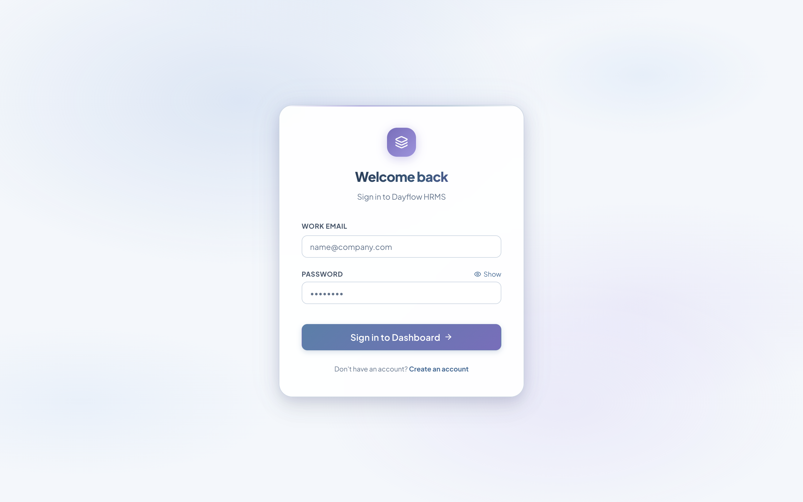 | 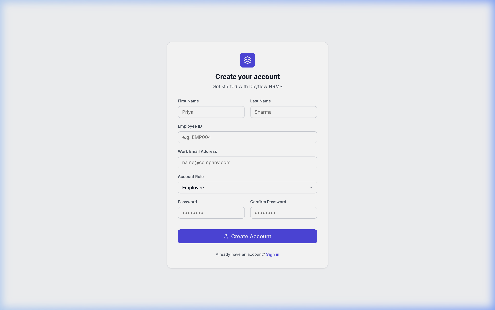 |

---

### 👑 Admin / HR Officer Views

| 📊 Admin Dashboard (KPIs & Analytics) | 👥 Employee Directory |
| :---: | :---: |
| 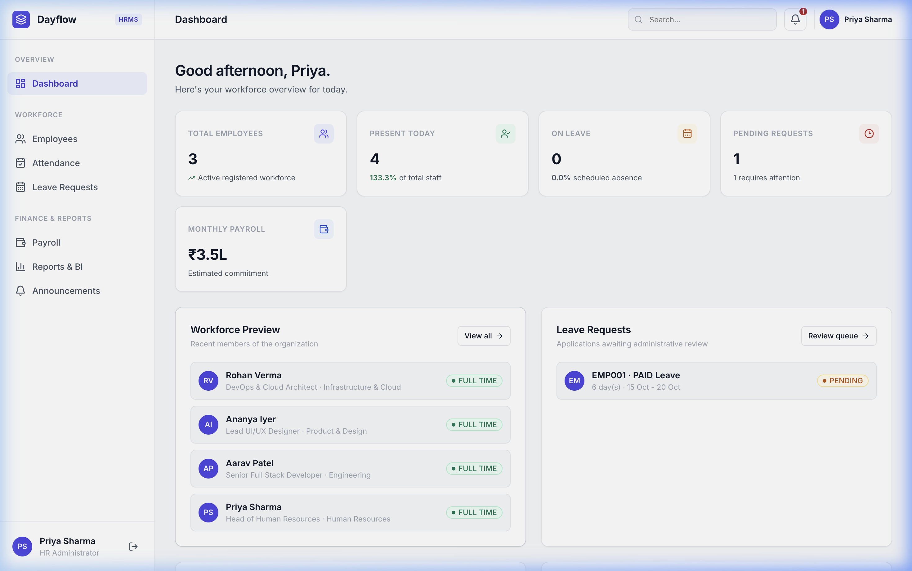 | 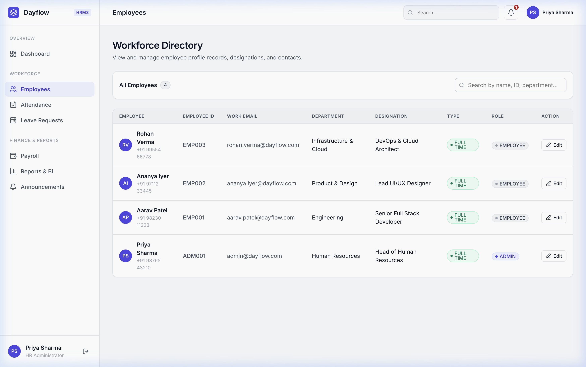 |

| ⏱️ Attendance Tracking (All Staff) | 🌴 Leave Approvals & Time-Off |
| :---: | :---: |
| 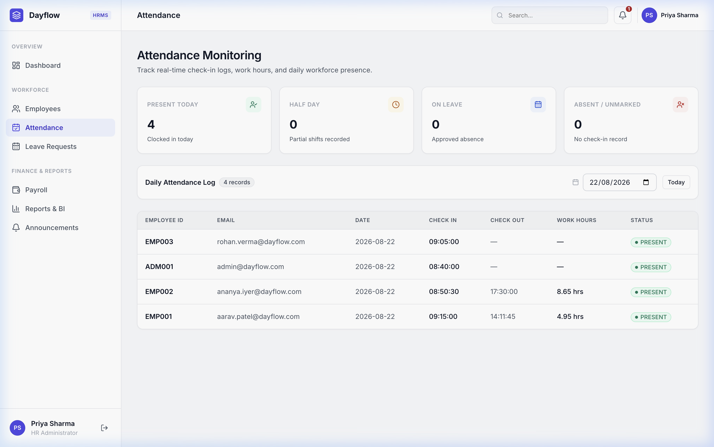 | 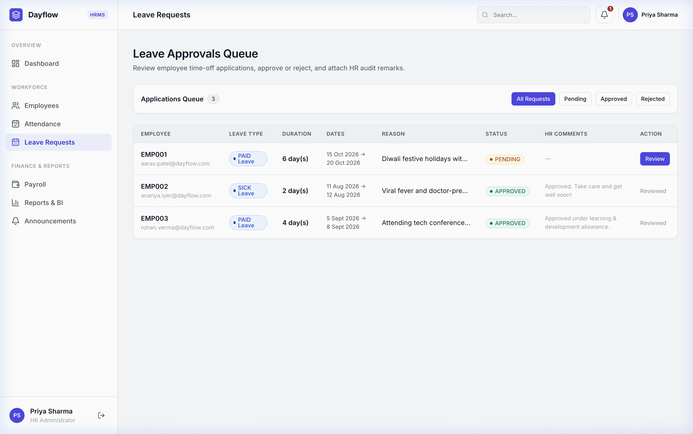 |

| 💰 Payroll Disbursement | 📈 Analytics & BI Reports |
| :---: | :---: |
| 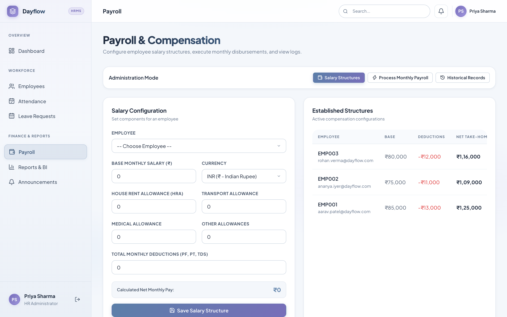 | 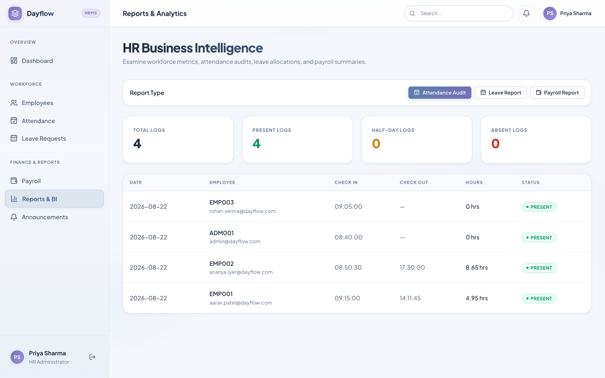 |

| 🔔 Notifications & Broadcasts |
| :---: |
| 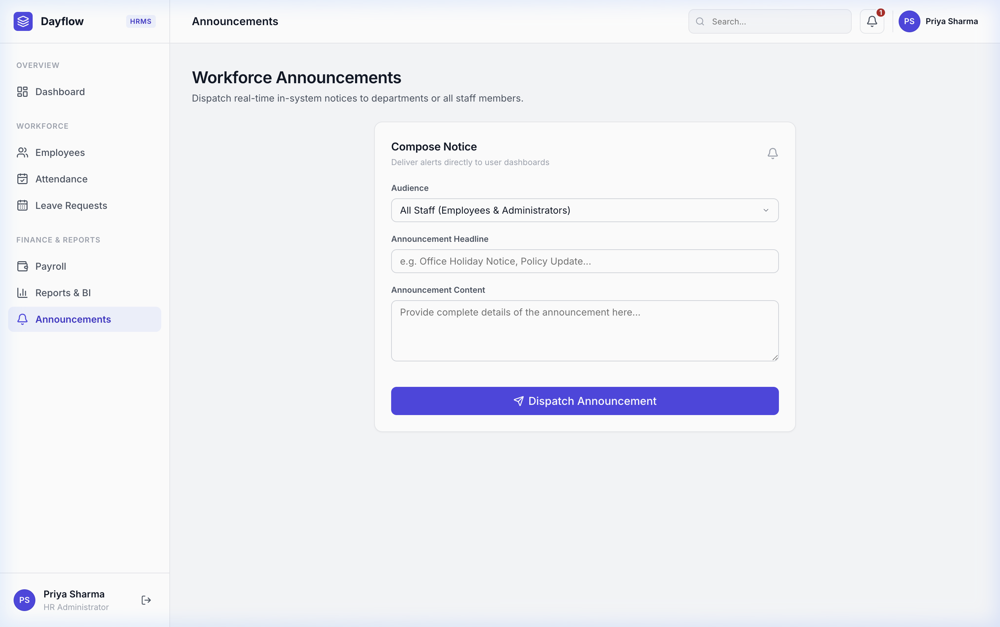 |

---

### 👤 Employee Self-Service Views

| 🏠 Employee Dashboard | 🪪 My Profile |
| :---: | :---: |
| 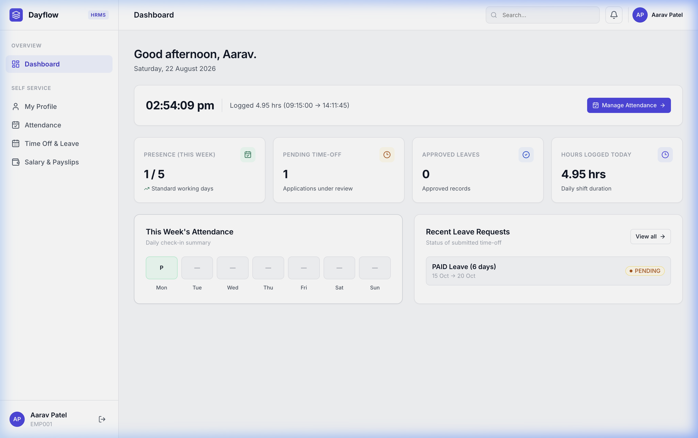 | 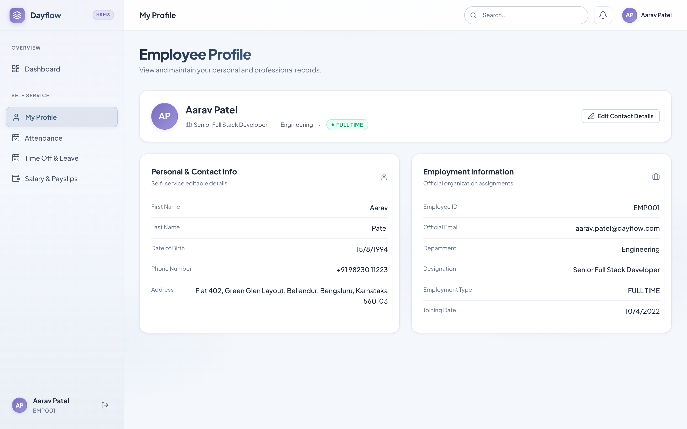 |

| ⏱️ My Attendance & Clock In/Out | 📝 My Leave Requests |
| :---: | :---: |
| 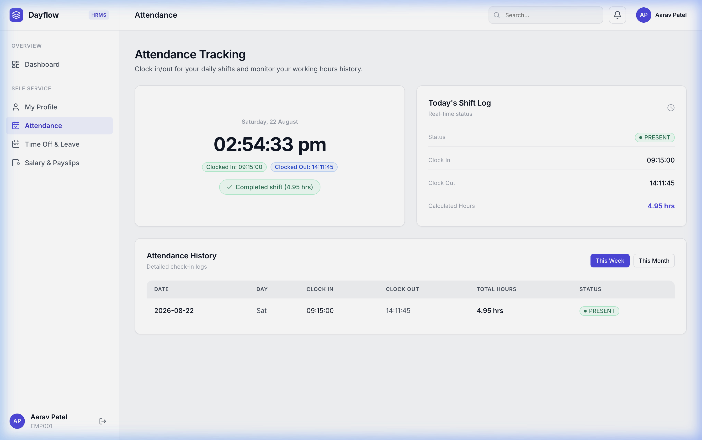 | 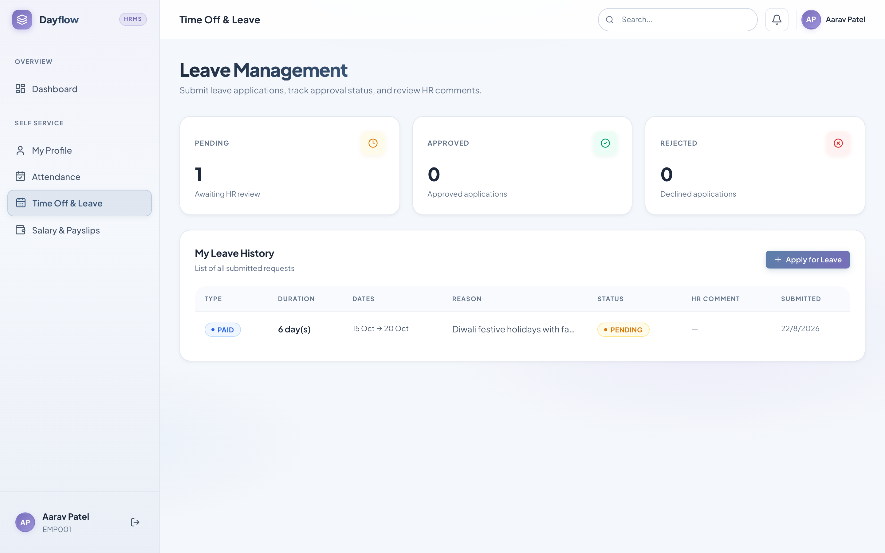 |

| 💵 My Payslips & Salary Breakdown |
| :---: |
| 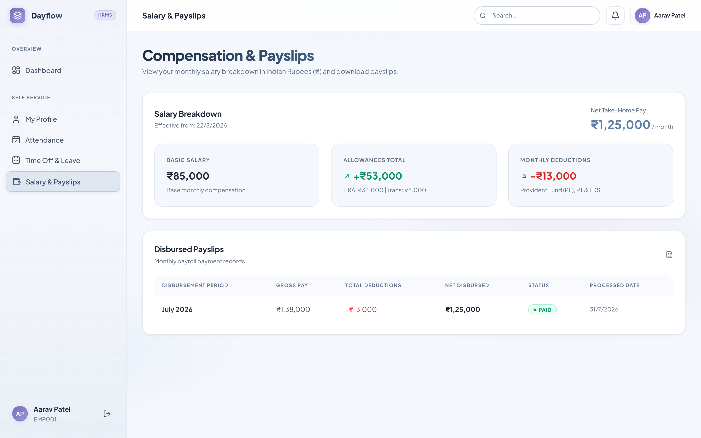 |

---

## ✨ Key Features

- 🔐 **Role-Based Access Control (RBAC)**: Secure authentication differentiating between **HR Admins** and **Employees**.
- ⏱️ **Real-Time Attendance**: One-click check-in / check-out with automated work-hour calculations.
- 🌴 **Leave & Time-off Workflows**: Request Paid, Sick, and Unpaid leave with dynamic duration calculations, admin approvals, and audit notes.
- 💵 **Automated Payroll & Payslips (INR / ₹)**: Configurable compensation structures including Base Salary, HRA, Medical & Transport allowances, with deductions for PF, Professional Tax, and TDS.
- 🔔 **Instant Notification Center**: Live updates for leave request approvals/rejections and payroll disbursements.
- 📈 **Workforce Analytics & BI Reports**: Real-time summary charts for headcount, attendance trends, and payroll expenditure.

---

## 🏗️ System Design Architecture

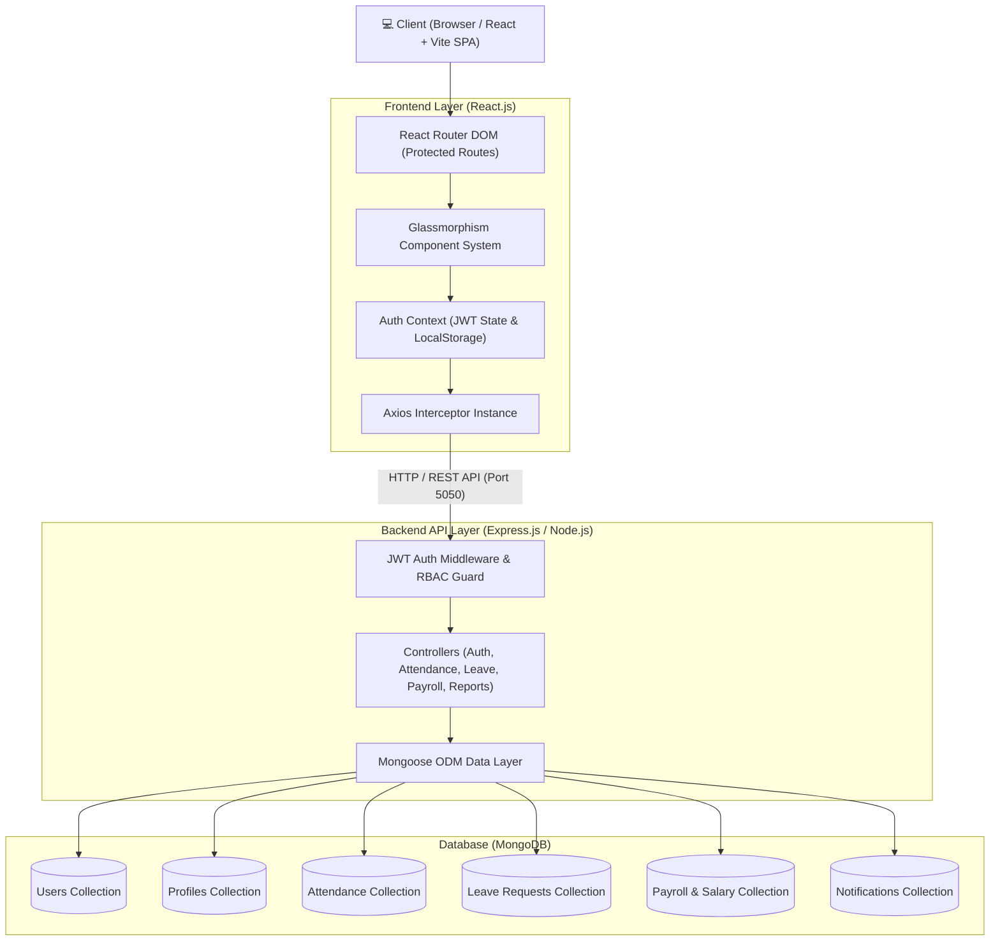

---

## 🗄️ Database Design (Entity-Relationship Diagram)

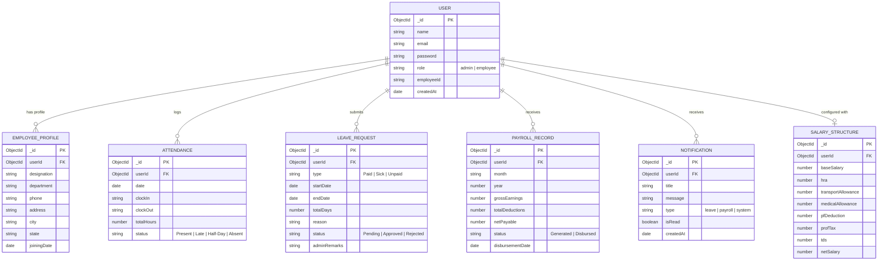

---

## 🛠️ Technology Stack

| Domain | Technology | Purpose |
| :--- | :--- | :--- |
| **Frontend Framework** | [React 19](https://react.dev/) + [Vite](https://vitejs.dev/) | Lightning fast UI rendering and hot module replacement |
| **Styling** | Vanilla CSS Glassmorphism | Custom responsive modern dark theme with smooth micro-animations |
| **Routing** | [React Router DOM v7](https://reactrouter.com/) | Protected route guards and nested dashboard navigation |
| **Icons** | [Lucide React](https://lucide.dev/) | Clean, minimalist SVG icon set |
| **Backend API** | [Node.js](https://nodejs.org/) & [Express.js](https://expressjs.com/) | Modular RESTful API backend |
| **Database** | [MongoDB](https://www.mongodb.com/) + [Mongoose](https://mongoosejs.com/) | Schema-driven document storage and relational joins |
| **Authentication** | JSON Web Tokens (JWT) + Bcrypt.js | Stateless authentication & cryptographic password hashing |

---

## 🚀 How to Run Locally

### 📋 Prerequisites
- **Node.js** (v18.0.0 or higher)
- **MongoDB** running locally on `mongodb://localhost:27017`

---

### Step 1: Clone the Repository
```bash
git clone https://github.com/BhoomikaSoni03/Dayflow-oddo-hackathon.git
cd Dayflow-oddo-hackathon
```

---

### Step 2: Backend Setup
```bash
# Navigate to backend directory
cd backend

# Install backend dependencies
npm install

# Seed the database with pre-configured demo users and records
npm run seed

# Start backend server
npm start
```
> 🌐 Backend will start on: **`http://localhost:5050`**

---

### Step 3: Frontend Setup
Open a new terminal window:
```bash
# Navigate to frontend directory
cd frontend

# Install frontend dependencies
npm install

# Start Vite development server
npm run dev
```
> 🌐 Frontend app will start on: **`http://localhost:5173`**

---

## 🔑 Demo Login Accounts

You can immediately sign in using any of the pre-configured seed accounts:

| Role | Name | Email | Password | Employee ID |
| :--- | :--- | :--- | :--- | :--- |
| **👑 Admin (HR Head)** | Priya Sharma | `admin@dayflow.com` | `Admin@123` | `ADM001` |
| **👤 Senior Engineer** | Aarav Patel | `aarav.patel@dayflow.com` | `Employee@123` | `EMP001` |
| **👤 Lead UI/UX Designer** | Ananya Iyer | `ananya.iyer@dayflow.com` | `Employee@123` | `EMP002` |
| **👤 Cloud Architect** | Rohan Verma | `rohan.verma@dayflow.com` | `Employee@123` | `EMP003` |

---

## 📁 Repository Structure

```
Dayflow-oddo-hackathon/
├── backend/
│   ├── src/
│   │   ├── config/          # MongoDB Mongoose connection
│   │   ├── controllers/     # Controller logic (Auth, Leaves, Attendance, Payroll)
│   │   ├── middleware/      # JWT validation & Role-based Access Control (RBAC)
│   │   ├── models/          # Mongoose Schemas (User, Attendance, Leaves, etc.)
│   │   ├── routes/          # Express API route declarations
│   │   ├── seed.js          # Pre-configured demo data generator
│   │   └── app.js           # Express application initialization
│   ├── .env.example
│   └── package.json
│
├── frontend/
│   ├── src/
│   │   ├── components/      # Glassmorphism Cards, Layouts, Navigation Bar
│   │   ├── context/         # AuthContext with session persistence
│   │   ├── pages/
│   │   │   ├── auth/        # Login & Register views
│   │   │   ├── admin/       # HR Management, Attendance, Payroll, Reports
│   │   │   └── employee/    # Employee Self-Service, Leave requests, Payslips
│   │   ├── services/        # Centralized Axios API service layer
│   │   ├── App.jsx          # Protected route declarations
│   │   └── index.css        # Global CSS design tokens
│   ├── index.html
│   └── package.json
│
├── docs/
│   └── screenshots/         # Application preview screenshots
└── README.md
```

---

## 📄 License
Distributed under the MIT License.
